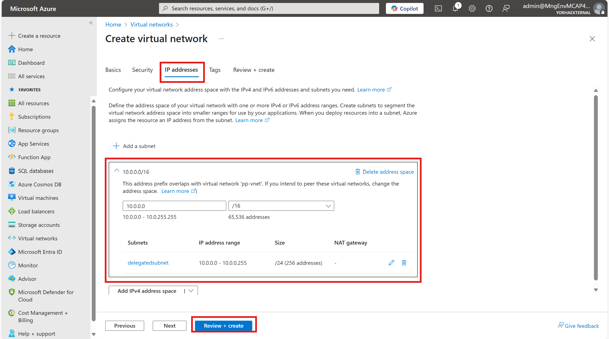

이 문서는 가상 네트워크 지원 기능을 구현하기 위한 핸즈온랩 문서입니다. Azure RBAC 권한, 구독, Power Platform 권한은 사용자가 이미 가지고 있다고 가정하고 해당 문서를 작성하였습니다. 최대한 직관적인 이해를 위해 가능한 부분은 Azure 포털 상에서 설정하도록 하였으며, 한국 리전에 대해 기능을 설정하는 것으로 가정하였습니다. Azure RABC, prerequisites 등의 내용을 포함한 공식 문서는 [링크](https://learn.microsoft.com/ko-kr/power-platform/admin/vnet-support-setup-configure?tabs=new)를 참고바랍니다.  
  
# 목차
  
- [목차](#목차)
- [리소스 그룹 생성하기](#리소스-그룹-생성하기)
- [가상 네트워크 생성하기](#가상-네트워크-생성하기)
- [가상 네트워크 위임 설정하기](#가상-네트워크-위임-설정하기)
- [마이크로소프트 Power Platform 공식 repository를 내 계정으로 fork 하기](#마이크로소프트-power-platform-공식-repository를-내-계정으로-fork-하기)
- [로컬 환경에 fork한 repository를 clone 하기](#로컬-환경에-fork한-repository를-clone-하기)
- [로컬 환경에 필요한 파워쉘 모듈 다운받기](#로컬-환경에-필요한-파워쉘-모듈-다운받기)
- [Subnet Injection(서브넷 위임) 설정하기](#subnet-injection서브넷-위임-설정하기)
- [파워플랫폼 환경 생성하기](#파워플랫폼-환경-생성하기)
- [파워플랫폼 환경 설정하기](#파워플랫폼-환경-설정하기)
- [가상 네트워크 지원 기능이 제대로 설정 됐는지 확인하기](#가상-네트워크-지원-기능이-제대로-설정-됐는지-확인하기)

# 리소스 그룹 생성하기
  

  
# 가상 네트워크 생성하기
  
한국에 Power Platform 환경을 생성한 경우, 한국 중부 및 한국 남부 리전에 각각 가상 네트워크 및 위임할 서브넷을 생성해 주어야 합니다.
   1. 한국 중부에 가상 네트워크 + 위임할 서브넷 생성하기
   이전에 생성했던 리소스 그룹을 선택합니다.  
   리소스를 배포할 리전은 Korea Central(한국 중부)을 선택합니다.  
   가상네트워크 주소는 10.0.0.0/16으로 설정합니다.  
   서브넷 위임을 사용할 서브넷 주소는 10.0.0.0/24로 설정합니다. 이해를 돕기 위해 서브넷명은 delegatedsubnet으로 하였습니다.
   
   
   
   2. 한국 남부에 가상 네트워크 + 위임할 서브넷 생성하기
   역시 이전에 생성했던 리소스 그룹을 생성하고, 이번에는 한국 남부에 가상 네트워크를 생성합니다.
   
   

# 가상 네트워크 위임 설정하기
  
한국 중부에 생성해 놓았던 가상 네트워크를 선택한 후, delegatedsubnet을 선택합니다.  
Subnet Delegation에서 Microsoft.PowerPlatform/enterprisePolicies를 선택한 후 Save 버튼을 누릅니다.  
한국 남부에 생성해 놓았던 가상 네트워크에도 서브넷 위임을 동일하게 설정합니다.  


  
# 마이크로소프트 Power Platform 공식 repository를 내 계정으로 fork 하기
  
이제부터 포털이 아닌 마이크로소프트 공식 repository에서 제공하는 파워쉘 스크립트를 통해 설정해야 합니다.  
[repo 링크](https://github.com/microsoft/PowerApps-Samples/tree/master)를 내 github 계정으로 fork합니다.  

# 로컬 환경에 fork한 repository를 clone 하기
  
로컬 환경에 아래 명령어를 통해 fork한 repository를 clone합니다. 로컬에 git이 없는 경우 설치가 필요합니다.  
``` 
git clone https://github.com/사용자 깃헙 계정/PowerApps-Samples.git 
```

# 로컬 환경에 필요한 파워쉘 모듈 다운받기
  
관리자 권한으로 PowerShell ISE를 실행합니다.  
  

  
아래 세 줄의 명령어를 실행합니다.  
```
Install-Module -Name Microsoft.PowerApps.Administration.PowerShell -AllowClobber -Force
Install-Module -Name Microsoft.PowerApps.PowerShell -AllowClobber -Force
Install-Module -Name Az -AllowClobber -Force
```
  
# Subnet Injection(서브넷 위임) 설정하기
  
이전에 repository를 clone한 위치(...\enterprisePolicies\SubnetInjection)로 가서 CreateSubnetInjectionEnterprisePolicy.ps1를 실행합니다.  
팝업 창에서는 'Run once'를 클릭합니다.  
물어보는 정보는 아래 화면에서 찾을 수 있습니다.  
  

* subscriptionId : 구독 Id  
* resourceGroup : 생성한 리소스그룹명 입력  
* enterprisePolicyName : enterprise policy명 입력 (예시 : ppvnetsupport)  
* enterprisePolicyLocation : korea  
* primaryVnetId : 한국 중부에 생성한 가상 네트워크의 resource ID  
* primarySubnetName : 서브넷 위임을 설정한 한국 중부 가상 네트워크의 서브넷명  
* secondaryVnetId : 한국 남부에 생성한 가상 네트워크의 resource ID  
* secondarySubnetName : 서브넷 위임을 설정한 한국 남부 가상 네트워크의 서브넷명  
  
로그인 화면에서 인증 작업까지 마치면 아래와 같은 output을 확인할 수 있습니다.  
  

  
output에 나온 ResourceId는 필요한 정보이니 메모장에 따로 기입해 둡니다.
```
"ResourceId":  "/subscriptions/f82bcf2d-de71-4dad-af50-dd980634d7d5/resourceGroups/ppvnetsupport-rg/providers/Microsoft.PowerPlatfor
m/enterprisePolicies/ppvnetsupport"
```
  
# 파워플랫폼 환경 생성하기
  
테스트 진행을 위해 파워플랫폼 환경을 생성합니다. [Power Platform admin center](https://admin.powerplatform.microsoft.com/home)로 가서 환경을 생성합니다.  
  


# 파워플랫폼 환경 설정하기
  
이전에 repository를 clone한 위치(...\enterprisePolicies\SubnetInjection)로 가서 NewSubnetInjection.ps1을 실행합니다.  
팝업창이 나타나면 Run once를 클릭합니다.  
파워플랫폼의 Environment ID는 아래 화면에서 확인할 수 있습니다.  
  
  
  
policyArmId는 이전 단계에서 메모장에 따로 기입해 두었던 ResourceId를 입력합니다. 복사해 둔 ResourceId에 엔터값이 포함돼 있을 수 있으니 주의가 필요합니다.  
Do you want to poll the linking operation (y/n)에는 'y'를 입력합니다.  
로그인 화면에서 인증 작업까지 마친 후 output 화면은 아래와 같습니다.  
  


# 가상 네트워크 지원 기능이 제대로 설정 됐는지 확인하기
  
생성해 놓은 파워플랫폼 환경에서 History를 클릭해 가상 네트워크 지원 기능이 제대로 설정됐는지 확인합니다.  
  
