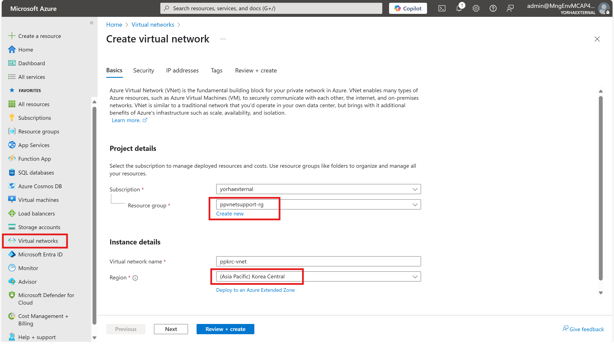
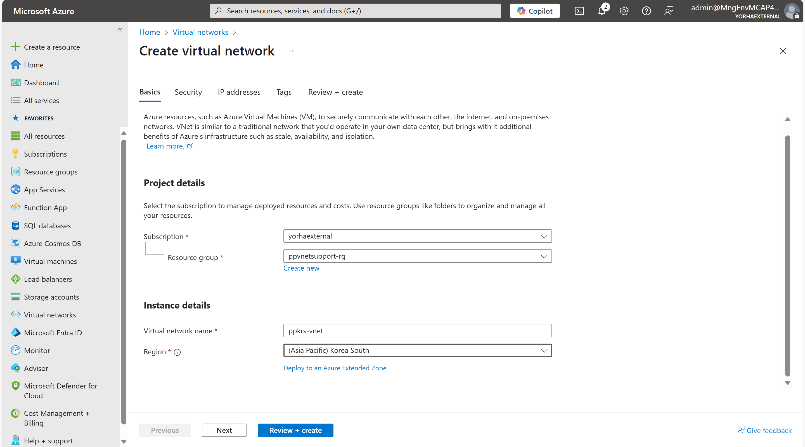
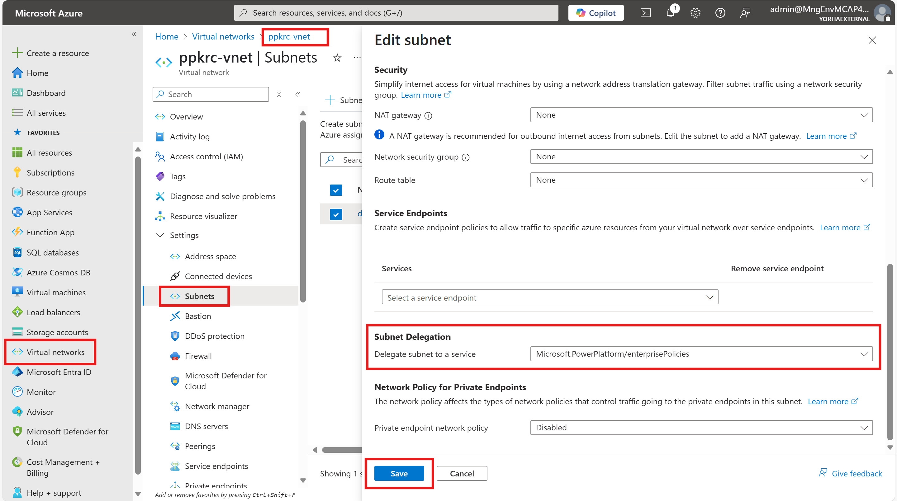
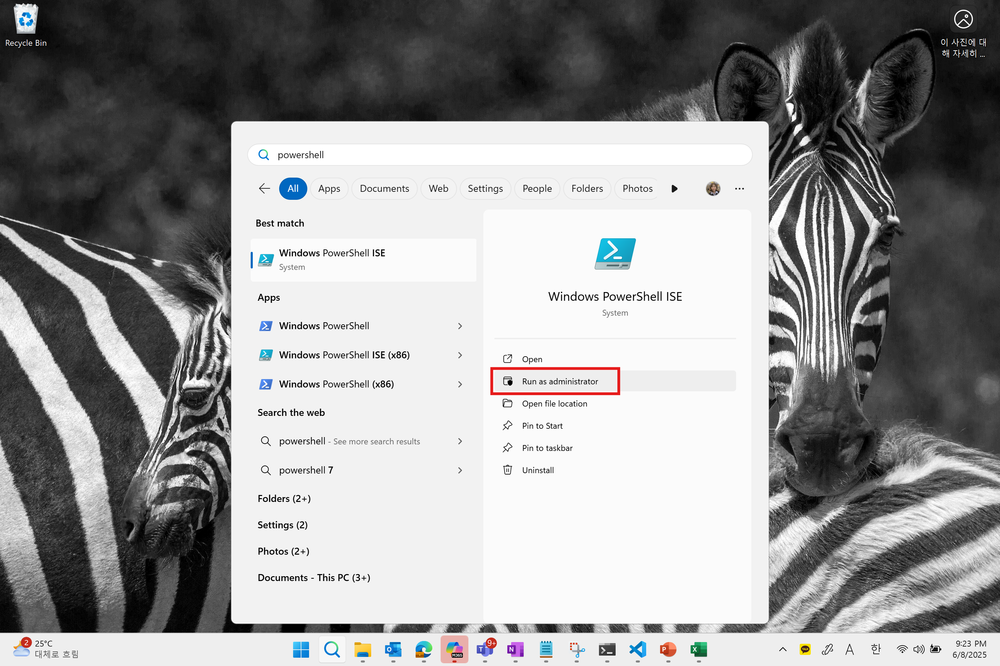

# Power Platform virtual network support hands on lab

이 문서는 가상 네트워크 지원 기능을 구현하기 위한 핸즈온랩 문서입니다. Azure RBAC 권한, 구독, Power Platform 권한은 사용자가 이미 가지고 있다고 가정하고 해당 문서를 작성하였습니다. 최대한 직관적인 이해를 위해 가능한 부분은 Azure 포털 상에서 설정하도록 안내하고 있으며, Azure RABC, prerequisites 등의 내용을 포함한 공식 문서는 [링크](https://learn.microsoft.com/ko-kr/power-platform/admin/vnet-support-setup-configure?tabs=new)를 참고바랍니다.


리소스 그룹 생성하기
-----

  
가상 네트워크 생성하기
-----
한국에 Power Platform 환경을 생성한 경우, 한국 중부 및 한국 남부 리전에 각각 가상 네트워크 및 위임할 서브넷을 생성해 주어야 합니다.
   1. 한국 중부에 가상 네트워크 + 위임할 서브넷 생성하기
   이전에 생성했던 리소스 그룹을 선택합니다.  
   리소스를 배포할 리전은 Korea Central(한국 중부)을 선택합니다.  
   가상네트워크 주소는 10.0.0.0/16으로 설정합니다.  
   서브넷 위임을 사용할 서브넷 주소는 10.0.0.0/24로 설정합니다. 이해를 돕기 위해 서브넷명은 delegatedsubnet으로 하였습니다.
   
   
   
   2. 한국 남부에 가상 네트워크 + 위임할 서브넷 생성하기
   역시 이전에 생성했던 리소스 그룹을 생성하고, 이번에는 한국 남부에 가상 네트워크를 생성합니다.
   
   

가상 네트워크 위임 설정하기
-----
한국 중부에 생성해 놓았던 가상 네트워크를 선택한 후, delegatedsubnet을 선택합니다.  
Subnet Delegation에서 Microsoft.PowerPlatform/enterprisePolicies를 선택합니다.  

  
한국 남부에 생성해 놓았던 가상 네트워크에도 서브넷 위임을 동일하게 설정합니다.  
  
마이크로소프트 Power Platform 공식 repository를 내 계정으로 fork 하기
-----
이제부터 마이크로소프트 공식 repository에 있는 파워쉘 스크립트를 통해 설정해야 합니다.  
[repo 링크](https://github.com/microsoft/PowerApps-Samples/tree/master)를 내 github 계정으로 fork합니다.  

로컬 환경에 fork한 repository를 clone 하기
-----
로컬 환경에 아래 명령어를 통해 fork한 repository를 clone합니다. 로컬에 git이 없는 경우 설치가 필요합니다.  
``` git clone https://github.com/사용자 깃헙 계정/PowerApps-Samples.git ```

로컬 환경에 필요한 파워쉘 모듈 다운받기
-----
관리자 권한으로 PowerShell ISE를 실행합니다.

  
아래 세 줄의 명령어를 실행합니다.  
```
Install-Module -Name Microsoft.PowerApps.Administration.PowerShell -AllowClobber -Force
Install-Module -Name Microsoft.PowerApps.PowerShell -AllowClobber -Force
Install-Module -Name Az -AllowClobber -Force
```
  
Subnet Injection(서브넷 위임) 설정하기
-----
이전에 repository를 clone한 위치로 가서 CreateSubnetInjectionEnterprisePolicy.ps1를 실행합니다.  
팝업 창에서는 'Run once'를 클릭합니다.  
물어보는 정보는 아래 화면에서 찾을 수 있습니다.  

* subscriptionId : 구독 Id  
* resourceGroup : 생성한 리소스그룹명 입력력  
* enterprisePolicyName : enterprise policy명 입력 (예시 : ppvnetsupport)  
* enterprisePolicyLocation : korea  
* primaryVnetId : 한국 중부에 생성한 가상 네트워크의 resoruce ID  
* primarySubnetName : 서브넷 위임을 설정한 한국 중부 가상 네트워크의 서브넷명  
* secondaryVnetId : 한국 남부에 생성한 가상 네트워크의 resoruce ID  
* secondarySubnetName : 서브넷 위임을 설정한 한국 남부 가상 네트워크의 서브넷명  
* can put N/A for geo's with only 1 supported region, must be provided for geos with 2+ supported regions  

로그인 화면에서 인증 작업까지 마치면 해당 탭은 닫아도 됩니다.  
아래와 같은 output을 확인할 수 있습니다.  
  
