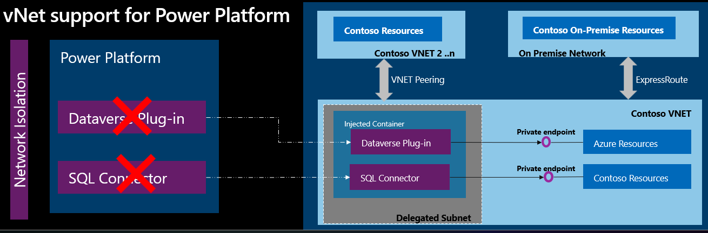

# Power Platform virtual network support

이 문서는 다음 [링크](https://learn.microsoft.com/en-us/power-platform/admin/vnet-support-overview)를 참고하였습니다.

개요
-----
Power Pltform의 virtual network(가상네트워크) 지원 기능을 통해 트래픽을 퍼블릭망에 노출하지 않고도 가상 네트워크 내부의 리소스와 Power Platform을 통합할 수 있습니다. Virtual Network 지원은 Azure subnet delegation(서브넷 위임)을 사용하여 Power Platform의 아웃바운드 트래픽을 관리합니다. 프라이빗 망을 통하기 때문에 사용자의 리소스가 노출될 우려가 없다는 장점이 있습니다. 가상 네트워크 지원을 활용하면 Power Platform에서 Azure 혹은은 온프레미스에 위치한 리소스를 호출할 수 있습니다. 또한 플러그인 및 커넥터를 사용하여 아웃바운드 호출을 수행할 수 있게 됩니다.

일반적으로 Power Platform은 퍼블릭망을 통해 엔터프라이즈 리소스와 통합해서 사용합니다. 퍼블릭망을 사용하는 경우 사용자의 리소스는 Azure IP 대역대를 방화벽에 추가하거나 혹은 서비스태그 목록을 통해 접근할 수 있어야 합니다. 그러나 Power Platform의 가상 네트워크 지원을 사용하면, 프라이빗망을 통해 엔터프라이즈망에 배포된 리소스와 통합해서 사용할 수 있습니다.

가상 네트워크 내에서는 Power Platform의 아웃바운드 트래픽에 대해 완전한 제어가 가능합니다. 만약 가상 네트워크와 관련된 Azure Policy가 적용돼 있다면, 해당 트래픽 역시 Azure Policy가 적용됩니다. 

이점
-----
- 데이터 보호: 가상네트워크 지원을 사용하면, Power Platform 서비스가 인터넷에 노출되지 않고 사용자의 프라이빗망에 배포된 리소스에 연결할 수 있습니다.
- 무단 접근 차단: 가상네트워크에 배포된 리소스의 방화벽에 Power Platform의 public IP를 추가하지 않아도 연결할 수 있기 때문에 허가받지 않은 접근에 대한 위험이 없습니다.

가상네트워크 서브넷 사이즈 고려사항
-----
Microsoft에서는 프로덕션 환경에 필요한 가용 ip를 25-30개, 개발 환경에 필요한 가용 ip는 6-10개를 권고합니다. 만약 여러 Power Platform 환경에서 동일한 서브넷을 사용한다면 권고 사항보다 더 많은 ip가 필요할 수 있습니다. 주의할 점은, Azure에서 서브넷을 만들 때 5개의 ip는 미리 예약돼 있는 주소라는 점입니다.

지원 시나리오
-----
Power Platform에서 가상 네트워크 지원 기능은 Dataverse 플러그인과 커넥터를 모두 지원합니다. Dataverse 플러그인과 커넥터는 Power Apps, Power Automate, Dynamics 365앱에서 외부 데이터 소스로 연결할 때 향상된 데이터 통합 보안 기능을 제공합니다. 

- Dataverse 플러그인을 사용하여 Azure SQL, Azure Storage, Blob Storage, Azure Key Vault 등과 같은 클라우드 데이터 소스에 연결할 수 있습니다. 이를 통해 데이터 유출 및 기타 사고로부터 데이터를 보호할 수 있습니다.

- Dataverse 플러그인을 사용하여 Azure 내의 Web API와 같은 프라이빗 엔드포인트로 보호된 리소스 또는 사설 네트워크 내의 SQL, Web API 등과 같은 리소스에 안전하게 연결할 수 있습니다. 이를 통해 데이터 유출 및 외부 위협으로부터 데이터를 보호할 수 있습니다.

- Virtual Network를 지원하는 SQL Server 등의 커넥터를 사용하여 Azure SQL 또는 SQL Server와 같은 클라우드에 호스팅된 데이터 소스에 인터넷에 노출되지 않고 안전하게 연결할 수 있습니다. 마찬가지로, Azure Queue 커넥터를 사용하여 프라이빗 엔드포인트가 활성화된 Azure Queue에 안전하게 연결할 수 있습니다.

- Azure Key Vault 커넥터를 사용하여 프라이빗 엔드포인트로 보호된 Azure Key Vault에 안전하게 연결할 수 있습니다.

- 사용자 지정 커넥터를 사용하여 Azure의 프라이빗 엔드포인트로 보호된 서비스 또는 사설 네트워크 내에 호스팅된 서비스에 안전하게 연결할 수 있습니다.

- Azure File Storage를 사용하여 프라이빗 엔드포인트가 활성화된 Azure 파일 저장소에 안전하게 연결할 수 있습니다.

지원하는 리전 및 서비스
-----
한국 중부 리전 및 한국 남부 리전을 지원합니다.

고려사항
-----
