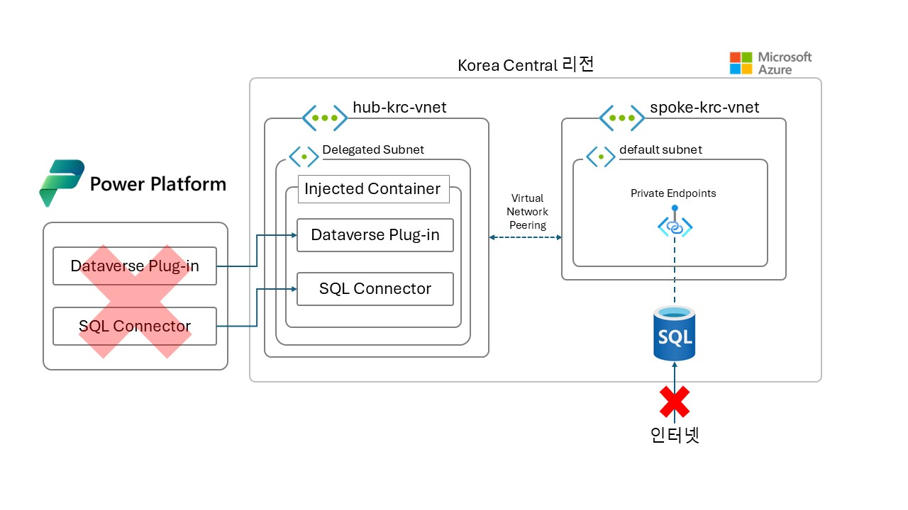

# 목차
  
- [목차](#목차)
- [테스트 구성도](#테스트-구성도)
- [테스트 시나리오](#테스트-시나리오)
- [리소스 생성 순서](#리소스-생성-순서)
- [리소스 생성하기](#리소스-생성하기)

# 테스트 구성도

# 테스트 시나리오
  
일반적인 엔터프라이즈 랜딩존과 유사한 시나리오를 위해 subnet injection이 설정된 가상네트워크 외 spoke 가상네트워크(spoke-krc-vnet)를 생성합니다. 두 가상네트워크는 vnet peering으로 연결하여 양쪽 네트워크에서 통신이 가능하도록 설정합니다. SQL Server 리소스를 생성한 후 public access는 모두 차단하고, private endpoint를 설정하여 spoke-krc-vnet 가상네트워크와 연결합니다. 위 아키텍쳐처럼 Power Platform에서 트래픽이 시작되어 Azure SQL Server의 데이터를 활용할 수 있는지 확인합니다.
  
# 리소스 생성 순서

0. 해당 핸즈온랩은 Power Platform virtual network support 기능을 위한 virtual network(리소스 명 : hub-krc-vnet)는 이미 생성되었으며, subnet injection기능까지 구현했다고 가정합니다. 만약 아직 구성하지 않았다면 [링크](https://github.com/youkhi/Power-Platform-virtual-network-support/blob/main/Configuration%20Hands%20on%20Lab.md)를 참조하세요.  
1. Spoke 가상 네트워크 생성
   리소스 명 : spoke-krc-vnet
   hub-krc-vnet과 IP 대역이 겹치지 않도록 주의합니다.
2. SQL Server 리소스 생성
3. SQL Server 리소스에 public access 막기
4. SQL Server 리소스에 private endpoint 구성하기
5. hub-krc-vnet과 spoke-krc-vnet간 vnet peering 구성하기
6. SQL Server private endpoint의 DNS를 hub-krc-vnet에서 resolution 할 수 있도록 설정하기
7. Power Automate 구성하기
8. 테스트
  
# 리소스 생성하기
  

  

  

