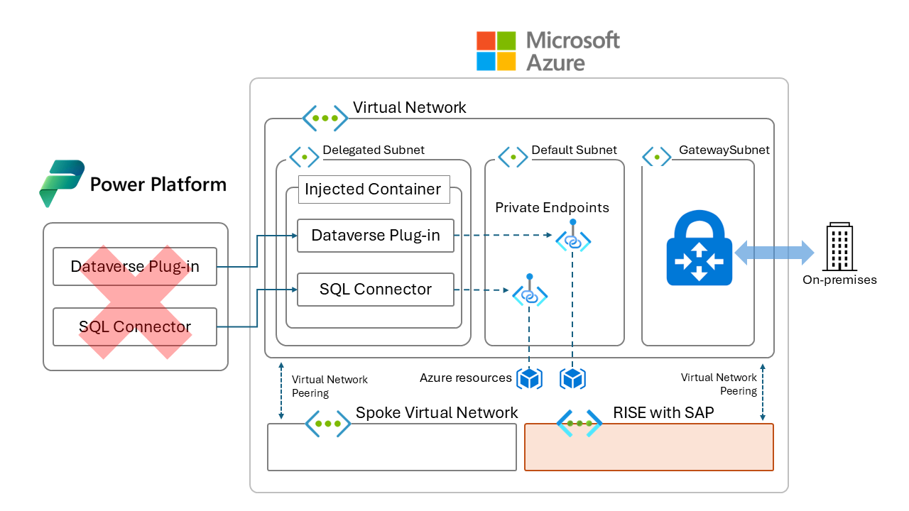

# 목차
  
- [목차](#목차)
- [테스트 시나리오](#테스트-시나리오)
- [리소스 생성 순서](#리소스-생성-순서)
- [가상네트워크 서브넷 사이즈 고려사항](#가상네트워크-서브넷-사이즈-고려사항)
- [지원 시나리오](#지원-시나리오)
- [지원하는 리전 및 서비스](#지원하는-리전-및-서비스)
- [고려사항](#고려사항)
- [FAQ](#faq)
- [가상 네트워크 지원 구성하기](#가상-네트워크-지원-구성하기)

# 테스트 시나리오
  
이미지 첨부 예정

이 문서는 마이크로소프트의 공식 문서([링크](https://learn.microsoft.com/en-us/power-platform/admin/vnet-support-overview))를 참고하였습니다.

  
# 리소스 생성 순서

0. 해당 핸즈온랩은 Power Platform virtual network support 기능을 위한 virtual network(리소스 명 : hub-krc-vnet)는 이미 생성되었으며, subnet injection기능까지 구현했다고 가정합니다. 만약 아직 구성하지 않았다면 [링크](https://github.com/youkhi/Power-Platform-virtual-network-support/blob/main/Hands%20on%20Lab.md)를 참조하세요.  
1. spoke-krc-vnet
2. SQL Server 리소스 생성
3. SQL Server 리소스에 public access 막기
4. SQL Server 리소스에 private endpoint 구성하기
5. hub-krc-vnet과 spoke-krc-vnet간 vnet peering 구성하기
6. SQL Server private endpoint의 DNS를 hub-krc-vnet에서 resolution 할 수 있도록 설정하기
7. Power Automate 구성하기
8. 테스트
  
# 가상네트워크 서브넷 사이즈 고려사항
  
Microsoft에서는 프로덕션 환경에 필요한 가용 ip를 25-30개, 개발 환경에 필요한 가용 ip는 6-10개를 권고합니다. 만약 여러 Power Platform 환경에서 동일한 서브넷을 사용한다면 권고 사항보다 더 많은 ip가 필요할 수 있습니다. 주의할 점은, Azure에서 서브넷을 만들 때 5개의 ip는 미리 예약돼 있는 주소라는 점입니다. 서브넷 위임을 설정한 후 서브넷 사이즈를 변경하게 되면 예상과 다르게 동작할 수 있습니다. 만약 서브넷 사이즈 변경이 필요할 경우 우선 위임 기능을 해제한 후 재설정이 필요합니다.  
  
# 지원 시나리오
  
Power Platform에서 가상 네트워크 지원 기능은 Dataverse 플러그인과 커넥터를 모두 지원합니다. Dataverse 플러그인과 커넥터는 Power Apps, Power Automate, Dynamics 365앱에서 외부 데이터 소스로 연결할 때 향상된 데이터 통합 보안 기능을 제공합니다. 
  
- Dataverse 플러그인을 사용하여 Azure SQL, Azure Storage, Blob Storage, Azure Key Vault 등과 같은 클라우드 데이터 소스에 연결할 수 있습니다. 이를 통해 데이터 유출 및 기타 사고로부터 데이터를 보호할 수 있습니다.
  
- Dataverse 플러그인을 사용하여 Azure 내 프라이빗 엔드포인트로 보호된 리소스 또는 프라이빗 망에 배포된 SQL, Web API 등과 같은 리소스에 안전하게 연결할 수 있습니다. 이를 통해 데이터 유출 및 외부 위협으로부터 데이터를 보호할 수 있습니다.
  
- 사용자 지정 커넥터를 사용하여 Azure의 프라이빗 엔드포인트로 보호된 서비스 또는 프라이빗 망에 배포된 서비스에 안전하게 연결할 수 있습니다.
  
- 이 외에도 커넥터를 지원하는 Azure 리소스에 대해 안전하게 연결할 수 있습니다. 아래 지원하는 리전 및 서비스 문단에 지원하는 커넥터가 기재돼있습니다.
  
# 지원하는 리전 및 서비스  
  
**한국 중부 리전 및 한국 남부 리전**을 지원합니다. 이 경우 가상 네트워크 지원 기능을 사용하려면, 가상네트워크(+ 서브넷 위임 기능을 지정할 서브넷)는 한국 남부 리전 및 한국 중부 리전에 각각 배포돼 있어야 합니다. 지원 리전 및 최신 서비스 리스트는 [링크](https://learn.microsoft.com/ko-kr/power-platform/admin/vnet-support-overview#supported-services)를 참고하세요.

| Area      | Power Platform services | Virtual Network support availability|
|-----------|-------------------------|-------------------------|
| Dataverse | [Dataverse plug-ins](/power-apps/developer/data-platform/plug-ins) | Generally available |
| Connectors | <ul><li>[SQL Server](/connectors/sql/)</li><li>[Azure SQL Data Warehouse](/connectors/sqldw/)</li><li>[Azure Queues](/connectors/azurequeues/)</li><li>[Custom connectors](/connectors/custom-connectors/)</li><li>[Azure Key Vault](/connectors/keyvault/)</li><li>[Azure File Storage](/connectors/azurefile/)</li><li>[Azure Blob Storage](/connectors/azureblob/)</li><li>[HTTP with Microsoft Entra ID (preauthorized)](/connectors/webcontents/)</li></ul> | Generally available |
| Connectors | <ul><li>[Snowflake](/connectors/snowflakeip/)</li></ul> | Preview |
  
# 고려사항

위임된 서브넷에서 요청을 실행할 때 발생하는 트래픽은 가상 네트워크에 적용된 정책의 영향을 받게 됩니다. 예를 들어서 가상 네트워크에서 퍼블릭 망으로 발생하는 트래픽을 금지한 상태에서 플러그인이 퍼블릭 망에 있는 서비스를 호출하려고 하는 경우 문제가 발생할 수 있습니다. 이 경우 해당 서비스를 Azure 환경 내 IaaS 방식으로 배포하거나 혹은 Azure의 PaaS 리소스를 사용 중이라면 private endpoint를 사용하는 것을 고려할 수 있습니다. 

# FAQ
  
**가상 네트워크 데이터 게이트웨이(Virtual Network Data Gateway)와 가상 네트워크 지원(Virtual Network support)의 차이점?**  
가상 네트워크 데이터 게이트웨이는 관리형 데이터 게이트웨이로써, 온프렘 환경에 데이터 게이트웨이를 배포하지 않고도 Azure와 Power Platform에 액세스 할 수 있도록 해줍니다. 예를 들어서 Power BI와 Power Platform 데이터 흐름(dataflow)에서 ETL 작업에 최적화 돼있습니다.  
가상 네트워크 지원 기능은 Power Platform 환경에서 가상 네트워크 서브넷을 사용하는 것입니다. Power Platform API가 주로 사용하는 기능이며, 한 번에 많은 양의 요청을 처리할 때 사용할 수 있습니다.  
가상 네트워크 지원 기능을 사용할 수 있는 경우는 Power BI와 Power Platform dataflow를 제외한 모든 Power Platform에서 발생하는 아웃바운드 호출 시나리오입니다. Power BI와 Power Platform dataflow는 가상 네트워크 데이터 게이트웨이를 사용합니다.  
  
**가상 네트워크 지원 기능이 failover를 지원하는지?**  
지원합니다. Power Platform에서 선택할 수 있는 Korea 리전과 연동된 리전은 한국 중부(Korea Central) 및 한국 남부(Korea South)이기 때문에 두 개의 리전에 가상 네트워크를 각각 배포하고 서브넷 위임도 각각 설정해야 합니다. 
  
**가상 네트워크에서 발생하는 아웃바운드 트래픽을 모니터링 할 수 있는지?**  
가능합니다. Network Security Group 혹은 방화벽을 통해 아웃바운드 트래픽을 확인할 수 있습니다.  
  
**플러그인이나 커넥터에서 인터넷으로 아웃바운드 호출을 할 수 있는지?**  
가능합니다. 위임된 서브넷에 NAT Gateway 구성이 필요합니다.  
  
**가상 네트워크 지원 기능을 사용하기 위해 Power Platform 테넌트를 Azure 구독에 연결해야 하는지?**  
해당 기능을 사용하기 위해 Azure 구독에 연결이 필요합니다.  
  
# 가상 네트워크 지원 구성하기
  
핸즈온랩은 [링크](https://github.com/youkhi/Power-Platform-virtual-network-support/blob/main/Hands%20on%20Lab.md)에 따로 정리돼있습니다.
  

